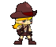
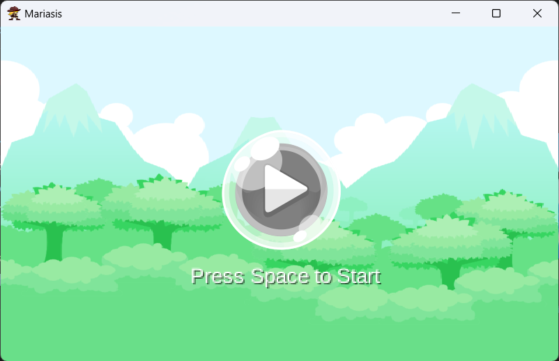
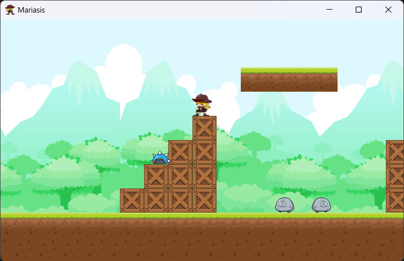
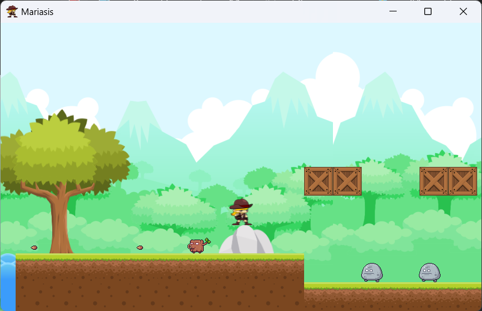
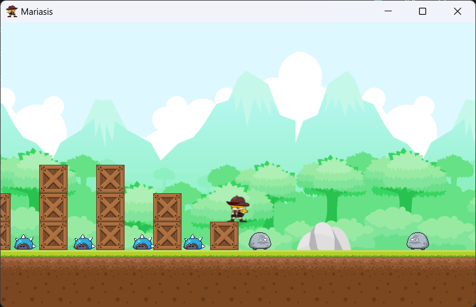
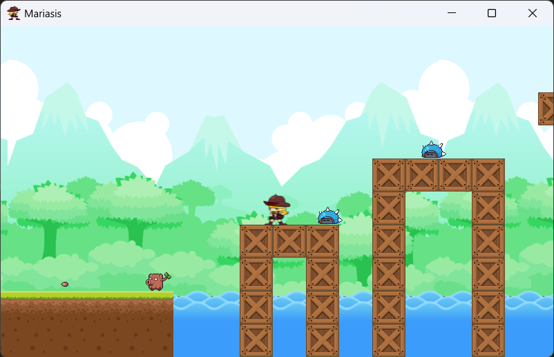
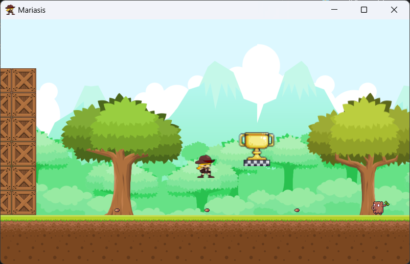
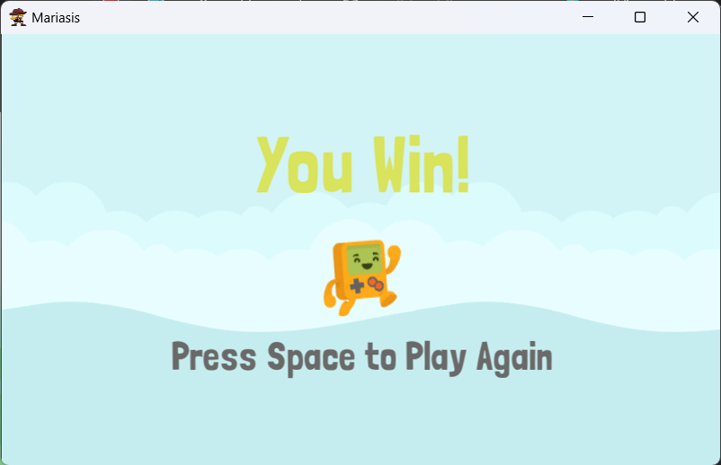
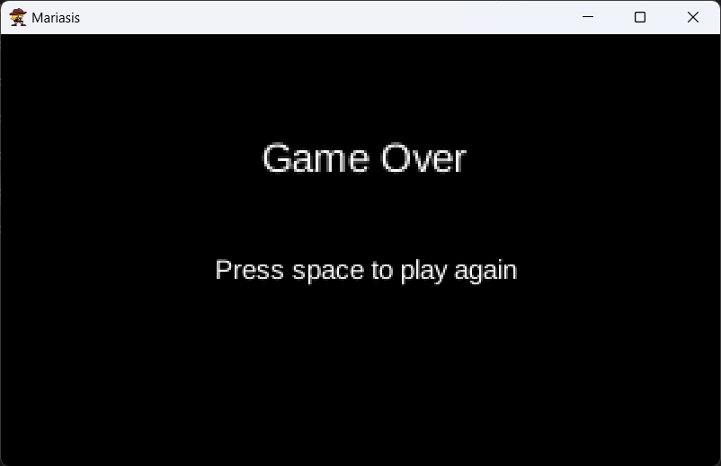

 

  

  <h3 align="center">Mariasis</h3>

## Description

Mariasis is a Super Mario bros like game created using Java and LibGDX as the game development framework. This game is our final project for Object Oriented Programming course.

### Running Project Locally

run the main method in `desktop\src\com\mygdx\mariasis\DesktopLauncher.java` file.

## Documentation

    <ul>
        <li>
            
Start Game

             
            
        </li>
        <li>
            
In Game

             
            
            
            
            
            
            
        </li>
        <li>
            
Win Screen

             
            
        </li>
        <li>
            
Game Over Screen

             
            
        </li>
    </ul>

